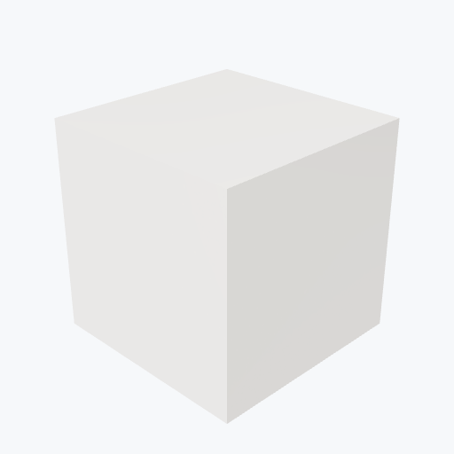

# Ceramics

13 materials. Click a name for full properties.

| Material | Preview | Density | E | T_melt |
|---|---|---|---|---|
| [Alumina](alumina.md) | <picture><source media="(prefers-color-scheme: dark)" srcset="previews/alumina_cube_dark.png"></picture> | 3.95 g/cm³ | 345 GPa | 2072 °C |
| [99.5% Alumina](alumina-al995.md) | — | 3.89 g/cm³ | 345 GPa | 2072 °C |
| [99.9% Alumina](alumina-al999.md) | — | 3.96 g/cm³ | 345 GPa | 2072 °C |
| [Zirconia](zirconia.md) | <picture><source media="(prefers-color-scheme: dark)" srcset="previews/zirconia_cube_dark.png"></picture> | 6.0 g/cm³ | 200 GPa | 2715 °C |
| [Silicon Carbide](sic.md) | <picture><source media="(prefers-color-scheme: dark)" srcset="previews/sic_cube_dark.png"></picture> | 3.1 g/cm³ | 410 GPa | 2700 °C |
| [Macor](macor.md) | <picture><source media="(prefers-color-scheme: dark)" srcset="previews/macor_cube_dark.png"></picture> | 2.52 g/cm³ | 66 GPa | 1000 °C |
| [Shapal](shapal.md) | <picture><source media="(prefers-color-scheme: dark)" srcset="previews/shapal_cube_dark.png"></picture> | 3.58 g/cm³ | 270 GPa | 1600 °C |
| [Glass](glass.md) | — | 2.5 g/cm³ | 70 GPa | 1600 °C |
| [Borosilicate Glass](glass-borosilicate.md) | — | 2.5 g/cm³ | 70 GPa | 1700 °C |
| [Fused Silica](glass-fused_silica.md) | — | 2.2 g/cm³ | 70 GPa | 1600 °C |
| [BK7 Optical Glass](glass-BK7.md) | — | 2.5 g/cm³ | 70 GPa | 1600 °C |
| [Beryllia](beryllia.md) | <picture><source media="(prefers-color-scheme: dark)" srcset="previews/beryllia_cube_dark.png"></picture> | 3.01 g/cm³ | 345 GPa | 2530 °C |
| [Yttria](yttria.md) | <picture><source media="(prefers-color-scheme: dark)" srcset="previews/yttria_cube_dark.png"></picture> | 5.0 g/cm³ | 170 GPa | 2410 °C |
