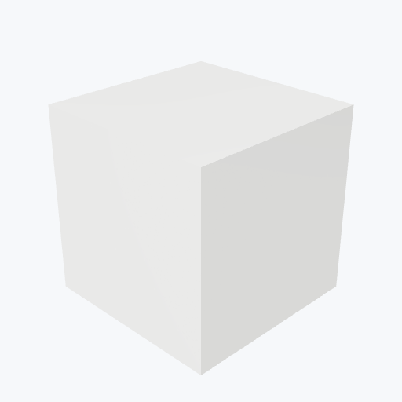

# Alumina

<picture><source media="(prefers-color-scheme: dark)" srcset="previews/alumina_cube_dark.png"></picture>

## Identity

| Field | Value |
|---|---|
| Formula | `Al2O3` |

## Mechanical Properties

| Property | Value |
|---|---|
| Density | 3.95 g/cm³ |
| Young's Modulus | 345 GPa |
| Yield Strength | 240 MPa |

## Thermal Properties

| Property | Value |
|---|---|
| Melting Point | 2072 °C |
| Thermal Conductivity | 30 W/(m·K) |
| Specific Heat | 880 J/(kg·K) |

## PBR (Rendering)

| Property | Value |
|---|---|
| Base Color | `(0.95, 0.95, 0.93, 1.0)` |
| Metallic | 0.0 |
| Roughness | 0.5 |

## Visual (mat-vis)

| Field | Value |
|---|---|
| Source | `ambientcg` |
| Material ID | `Porcelain001` |
| Finish | white |
| Available Finishes | white, smear |
