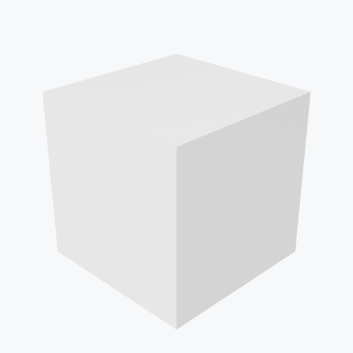

# Beryllia

<picture><source media="(prefers-color-scheme: dark)" srcset="previews/beryllia_cube_dark.png"></picture>

## Identity

| Field | Value |
|---|---|
| Formula | `BeO` |

## Mechanical Properties

| Property | Value |
|---|---|
| Density | 3.01 g/cm³ |
| Young's Modulus | 345 GPa |

## Thermal Properties

| Property | Value |
|---|---|
| Melting Point | 2530 °C |
| Thermal Conductivity | 270 W/(m·K) |

## PBR (Rendering)

| Property | Value |
|---|---|
| Base Color | `(0.9, 0.9, 0.9, 1.0)` |
| Metallic | 0.0 |
| Roughness | 0.3 |

## Visual (mat-vis)

| Field | Value |
|---|---|
| Source ID | `ambientcg/Porcelain001` |
| Finish | white |
| Available Finishes | white |
