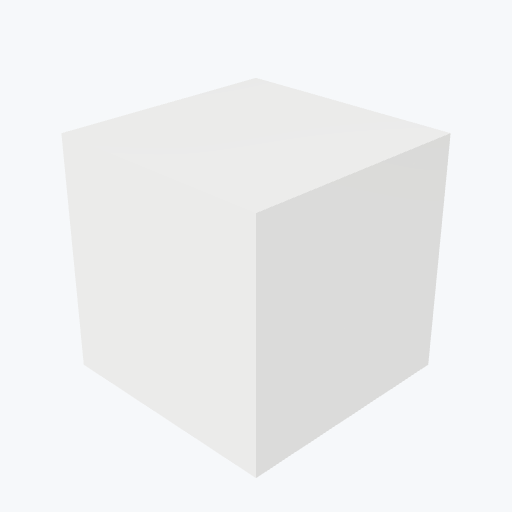

# Macor

<picture><source media="(prefers-color-scheme: dark)" srcset="previews/macor_cube_dark.png"></picture>

## Identity

| Field | Value |
|---|---|

## Mechanical Properties

| Property | Value |
|---|---|
| Density | 2.52 g/cm³ |
| Young's Modulus | 66 GPa |
| Yield Strength | 60 MPa |

## Thermal Properties

| Property | Value |
|---|---|
| Melting Point | 1000 °C |
| Thermal Conductivity | 1.46 W/(m·K) |

## PBR (Rendering)

| Property | Value |
|---|---|
| Base Color | `(0.98, 0.98, 0.96, 1.0)` |
| Metallic | 0.0 |
| Roughness | 0.4 |

## Visual (mat-vis)

| Field | Value |
|---|---|
| Source | `ambientcg` |
| Material ID | `Porcelain001` |
| Finish | white |
| Available Finishes | white |
