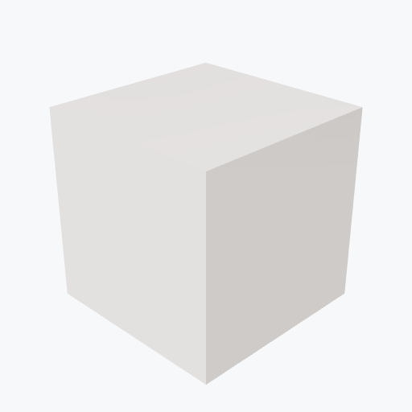

# Shapal

<picture><source media="(prefers-color-scheme: dark)" srcset="previews/shapal_cube_dark.png"></picture>

## Identity

| Field | Value |
|---|---|

## Mechanical Properties

| Property | Value |
|---|---|
| Density | 3.58 g/cm³ |
| Young's Modulus | 270 GPa |

## Thermal Properties

| Property | Value |
|---|---|
| Melting Point | 1600 °C |
| Thermal Conductivity | 17 W/(m·K) |

## PBR (Rendering)

| Property | Value |
|---|---|
| Base Color | `(0.85, 0.82, 0.8, 1.0)` |
| Metallic | 0.0 |
| Roughness | 0.5 |

## Visual (mat-vis)

| Field | Value |
|---|---|
| Source ID | `ambientcg/Porcelain001` |
| Finish | white |
| Available Finishes | white, smear |
