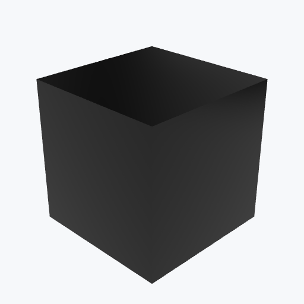

# Silicon Carbide

<picture><source media="(prefers-color-scheme: dark)" srcset="previews/sic_cube_dark.png"></picture>

## Identity

| Field | Value |
|---|---|
| Formula | `SiC` |

## Mechanical Properties

| Property | Value |
|---|---|
| Density | 3.1 g/cm³ |
| Young's Modulus | 410 GPa |
| Yield Strength | 350 MPa |

## Thermal Properties

| Property | Value |
|---|---|
| Melting Point | 2700 °C |
| Thermal Conductivity | 90 W/(m·K) |

## PBR (Rendering)

| Property | Value |
|---|---|
| Base Color | `(0.5, 0.5, 0.5, 1.0)` |
| Metallic | 0.0 |
| Roughness | 0.6 |

## Visual (mat-vis)

| Field | Value |
|---|---|
| Source | `ambientcg` |
| Material ID | `Porcelain003` |
| Finish | dark |
| Available Finishes | dark |
