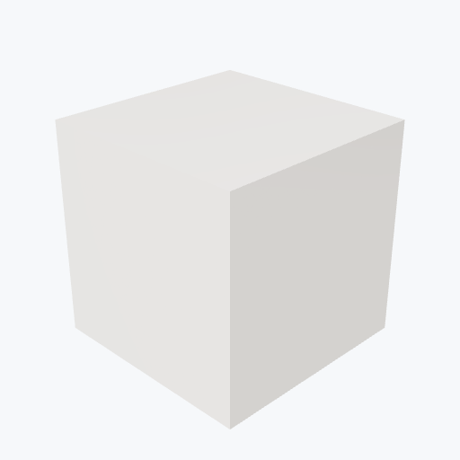

# Zirconia

<picture><source media="(prefers-color-scheme: dark)" srcset="previews/zirconia_cube_dark.png"></picture>

## Identity

| Field | Value |
|---|---|
| Formula | `ZrO2` |

## Mechanical Properties

| Property | Value |
|---|---|
| Density | 6.0 g/cm³ |
| Young's Modulus | 200 GPa |
| Yield Strength | 1000 MPa |

## Thermal Properties

| Property | Value |
|---|---|
| Melting Point | 2715 °C |
| Thermal Conductivity | 2.0 W/(m·K) |

## PBR (Rendering)

| Property | Value |
|---|---|
| Base Color | `(0.9, 0.88, 0.85, 1.0)` |
| Metallic | 0.0 |
| Roughness | 0.4 |

## Visual (mat-vis)

| Field | Value |
|---|---|
| Source | `ambientcg` |
| Material ID | `Porcelain001` |
| Finish | white |
| Available Finishes | white, black |
