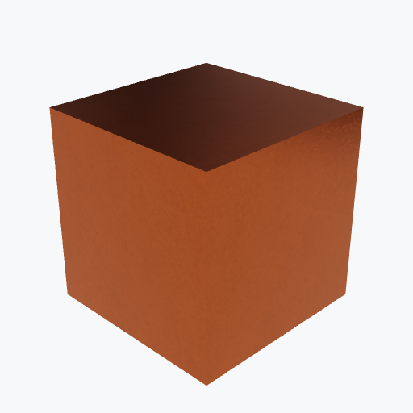

# Electronics

11 materials. Click a name for full properties.

| Material | Preview | Density |
|---|---|---|
| [FR4](fr4.md) | — | 1.86 g/cm³ |
| [Rogers RF Laminate](rogers.md) | — | 1.9 g/cm³ |
| [Rogers 4350B](rogers-r4350b.md) | — | 1.86 g/cm³ |
| [Kapton (Polyimide)](kapton.md) | — | 1.42 g/cm³ |
| [Copper (PCB)](copper_pcb.md) | <picture><source media="(prefers-color-scheme: dark)" srcset="previews/copper_pcb_cube_dark.png"></picture> | 8.96 g/cm³ |
| [1 oz Copper (35 µm)](copper_pcb-oz1.md) | — | 8.96 g/cm³ |
| [2 oz Copper (70 µm)](copper_pcb-oz2.md) | — | 8.96 g/cm³ |
| [Gold Plated Copper (ENIG)](copper_pcb-gold_plated.md) | — | 8.96 g/cm³ |
| [Solder](solder.md) | <picture><source media="(prefers-color-scheme: dark)" srcset="previews/solder_cube_dark.png"></picture> | 8.4 g/cm³ |
| [Sn63Pb37 (60% Tin / 40% Lead)](solder-Sn63Pb37.md) | — | 8.4 g/cm³ |
| [SAC305 (96.5% Tin / 3% Silver / 0.5% Copper)](solder-SAC305.md) | — | 7.3 g/cm³ |
