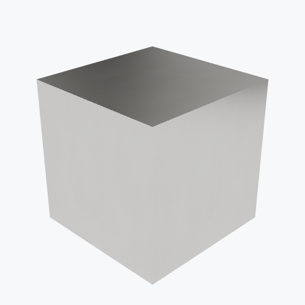

# Aluminum

<picture><source media="(prefers-color-scheme: dark)" srcset="previews/aluminum_cube_dark.png"></picture>

## Identity

| Field | Value |
|---|---|
| Formula | `Al` |

## Mechanical Properties

| Property | Value |
|---|---|
| Density | 2.7 g/cm³ |
| Young's Modulus | 69 GPa |
| Poisson's Ratio | 0.33 |

## Thermal Properties

| Property | Value |
|---|---|
| Melting Point | 660 °C |
| Thermal Conductivity | 235 W/(m·K) |
| Specific Heat | 900 J/(kg·K) |

## PBR (Rendering)

| Property | Value |
|---|---|
| Base Color | `(0.88, 0.88, 0.88, 1.0)` |
| Metallic | 1.0 |
| Roughness | 0.4 |

## Visual (mat-vis)

| Field | Value |
|---|---|
| Source ID | `ambientcg/Metal049A` |
| Finish | smooth |
| Available Finishes | smooth, machined |
