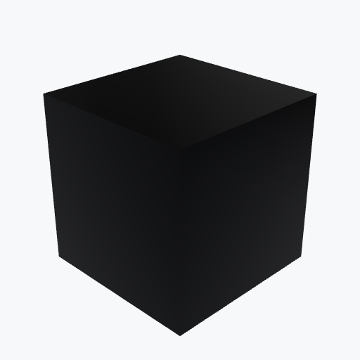

# Lead

<picture><source media="(prefers-color-scheme: dark)" srcset="previews/lead_cube_dark.png"></picture>

## Identity

| Field | Value |
|---|---|
| Formula | `Pb` |

## Mechanical Properties

| Property | Value |
|---|---|
| Density | 11.34 g/cm³ |
| Young's Modulus | 16 GPa |
| Yield Strength | 12 MPa |

## Thermal Properties

| Property | Value |
|---|---|
| Melting Point | 327 °C |
| Thermal Conductivity | 35.3 W/(m·K) |

## PBR (Rendering)

| Property | Value |
|---|---|
| Base Color | `(0.3, 0.3, 0.33, 1.0)` |
| Metallic | 1.0 |
| Roughness | 0.5 |

## Visual (mat-vis)

| Field | Value |
|---|---|
| Source ID | `ambientcg/Metal030` |
| Finish | dull |
| Available Finishes | dull, oxidized |
