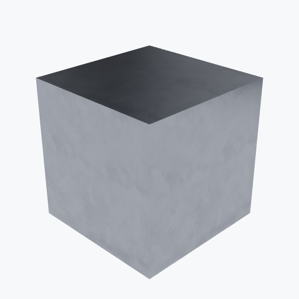

# Stainless Steel

<picture><source media="(prefers-color-scheme: dark)" srcset="previews/stainless_cube_dark.png"></picture>

## Identity

| Field | Value |
|---|---|

## Mechanical Properties

| Property | Value |
|---|---|
| Density | 8.0 g/cm³ |
| Young's Modulus | 193 GPa |
| Poisson's Ratio | 0.27 |

## Thermal Properties

| Property | Value |
|---|---|
| Melting Point | 1450 °C |
| Thermal Conductivity | 15.1 W/(m·K) |
| Specific Heat | 500 J/(kg·K) |

## PBR (Rendering)

| Property | Value |
|---|---|
| Base Color | `(0.75, 0.75, 0.77, 1.0)` |
| Metallic | 1.0 |
| Roughness | 0.3 |

## Visual (mat-vis)

| Field | Value |
|---|---|
| Source ID | `ambientcg/Metal012` |
| Finish | brushed |
| Available Finishes | brushed, polished, dirty |

## Composition

| Element | Fraction |
|---|---|
| Fe | 0.68 |
| Cr | 0.18 |
| Ni | 0.1 |
| Mn | 0.02 |
| Si | 0.01 |
| C | 0.005 |
