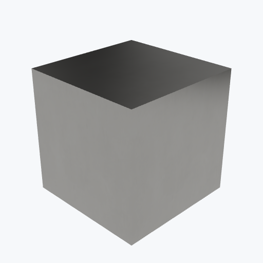

# Titanium

<picture><source media="(prefers-color-scheme: dark)" srcset="previews/titanium_cube_dark.png"></picture>

## Identity

| Field | Value |
|---|---|
| Formula | `Ti` |

## Mechanical Properties

| Property | Value |
|---|---|
| Density | 4.51 g/cm³ |
| Young's Modulus | 103 GPa |
| Yield Strength | 880 MPa |
| Tensile Strength | 950 MPa |

## Thermal Properties

| Property | Value |
|---|---|
| Melting Point | 1668 °C |
| Thermal Conductivity | 21.9 W/(m·K) |

## PBR (Rendering)

| Property | Value |
|---|---|
| Base Color | `(0.6, 0.6, 0.6, 1.0)` |
| Metallic | 1.0 |
| Roughness | 0.3 |

## Visual (mat-vis)

| Field | Value |
|---|---|
| Source ID | `ambientcg/Metal049A` |
| Finish | smooth |
| Available Finishes | smooth |
