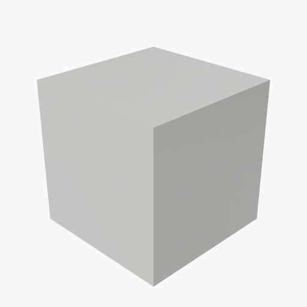
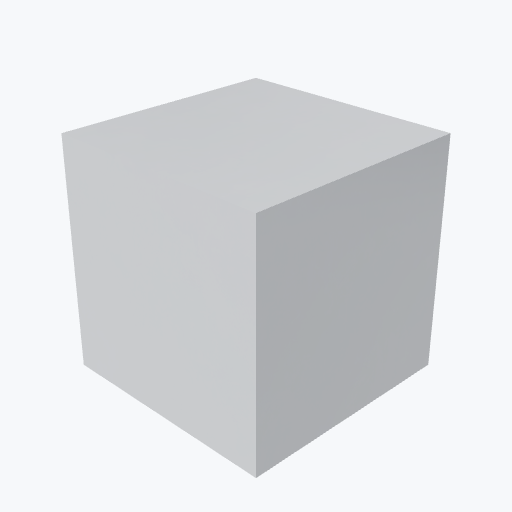
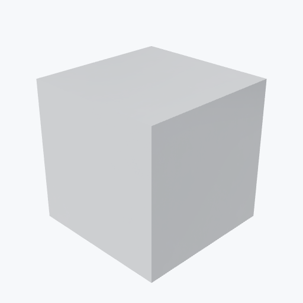
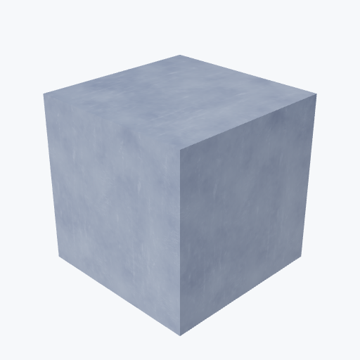
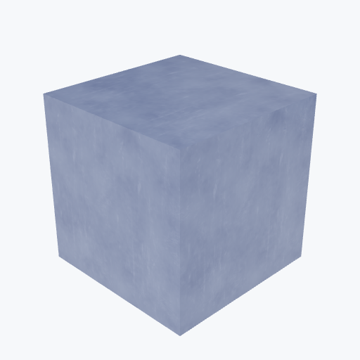

# Plastics

24 materials. Click a name for full properties.

| Material | Preview | Density | Yield | T_melt | k |
|---|---|---|---|---|---|
| [PEEK](peek.md) | <picture><source media="(prefers-color-scheme: dark)" srcset="previews/peek_cube_dark.png"></picture> | 1.32 g/cm³ | 100 MPa | 334 °C | 0.25 W/m·K |
| [PEEK Unfilled](peek-unfilled.md) | — | 1.32 g/cm³ | 100 MPa | 334 °C | 0.25 W/m·K |
| [PEEK 30% Glass Filled](peek-GF30.md) | — | 1.53 g/cm³ | 170 MPa | 334 °C | 0.25 W/m·K |
| [PEEK 30% Carbon Filled](peek-CF30.md) | — | 1.41 g/cm³ | 100 MPa | 334 °C | 0.25 W/m·K |
| [Victrex PEEK](peek-victrex.md) | — | 1.32 g/cm³ | 100 MPa | 334 °C | 0.25 W/m·K |
| [Delrin (POM)](delrin.md) | <picture><source media="(prefers-color-scheme: dark)" srcset="previews/delrin_cube_dark.png"></picture> | 1.41 g/cm³ | 70 MPa | 165 °C | 0.25 W/m·K |
| [Ultem (PEI)](ultem.md) | <picture><source media="(prefers-color-scheme: dark)" srcset="previews/ultem_cube_dark.png"></picture> | 1.27 g/cm³ | 90 MPa | 340 °C | 0.22 W/m·K |
| [PTFE (Teflon)](ptfe.md) | <picture><source media="(prefers-color-scheme: dark)" srcset="previews/ptfe_cube_dark.png"></picture> | 2.15 g/cm³ | 20 MPa | 327 °C | 0.24 W/m·K |
| [PTFE Reflector Tape](ptfe-reflector.md) | — | 2.15 g/cm³ | 20 MPa | 327 °C | 0.24 W/m·K |
| [ESR (3M Vikuiti)](esr.md) | <picture><source media="(prefers-color-scheme: dark)" srcset="previews/esr_cube_dark.png"></picture> | 1.0 g/cm³ | — | — | — |
| [Nylon 6](nylon.md) | <picture><source media="(prefers-color-scheme: dark)" srcset="previews/nylon_cube_dark.png"></picture> | 1.13 g/cm³ | 45 MPa | 215 °C | — |
| [PLA (Polylactic Acid)](pla.md) | <picture><source media="(prefers-color-scheme: dark)" srcset="previews/pla_cube_dark.png"></picture> | 1.25 g/cm³ | 50 MPa | 160 °C | — |
| [ABS (Acrylonitrile Butadiene Styrene)](abs.md) | <picture><source media="(prefers-color-scheme: dark)" srcset="previews/abs_cube_dark.png"></picture> | 1.05 g/cm³ | 40 MPa | 225 °C | — |
| [PETG](petg.md) | <picture><source media="(prefers-color-scheme: dark)" srcset="previews/petg_cube_dark.png"></picture> | 1.27 g/cm³ | — | 225 °C | — |
| [TPU (Thermoplastic Polyurethane)](tpu.md) | <picture><source media="(prefers-color-scheme: dark)" srcset="previews/tpu_cube_dark.png"></picture> | 1.21 g/cm³ | — | — | — |
| [Vespel (Polyimide)](vespel.md) | <picture><source media="(prefers-color-scheme: dark)" srcset="previews/vespel_cube_dark.png"></picture> | 1.42 g/cm³ | 70 MPa | 400 °C | — |
| [Torlon (PAI)](torlon.md) | <picture><source media="(prefers-color-scheme: dark)" srcset="previews/torlon_cube_dark.png"></picture> | 1.45 g/cm³ | 110 MPa | 330 °C | — |
| [PCTFE (Polychlorotrifluoroethylene)](pctfe.md) | <picture><source media="(prefers-color-scheme: dark)" srcset="previews/pctfe_cube_dark.png"></picture> | 2.13 g/cm³ | 50 MPa | 217 °C | — |
| [PMMA (Acrylic)](pmma.md) | <picture><source media="(prefers-color-scheme: dark)" srcset="previews/pmma_cube_dark.png"></picture> | 1.18 g/cm³ | 70 MPa | 160 °C | 0.19 W/m·K |
| [Polyethylene](pe.md) | <picture><source media="(prefers-color-scheme: dark)" srcset="previews/pe_cube_dark.png"></picture> | 0.94 g/cm³ | 25 MPa | 130 °C | 0.4 W/m·K |
| [HDPE (High-Density Polyethylene)](pe-hdpe.md) | — | 0.95 g/cm³ | 26 MPa | 130 °C | 0.4 W/m·K |
| [LDPE (Low-Density Polyethylene)](pe-ldpe.md) | — | 0.92 g/cm³ | 10 MPa | 110 °C | 0.4 W/m·K |
| [UHMWPE](pe-uhmwpe.md) | — | 0.93 g/cm³ | 20 MPa | 130 °C | 0.4 W/m·K |
| [Polycarbonate](pc.md) | <picture><source media="(prefers-color-scheme: dark)" srcset="previews/pc_cube_dark.png"></picture> | 1.2 g/cm³ | 60 MPa | 267 °C | 0.2 W/m·K |
