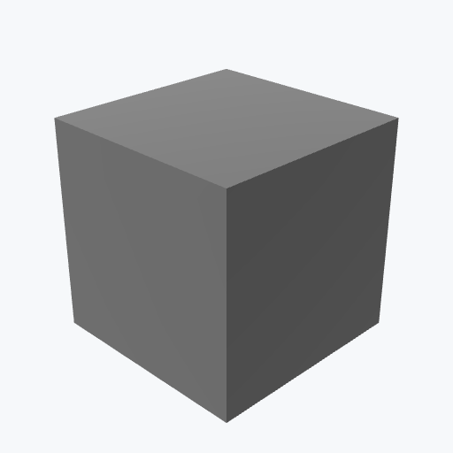

# ABS (Acrylonitrile Butadiene Styrene)

<picture><source media="(prefers-color-scheme: dark)" srcset="previews/abs_cube_dark.png"></picture>

## Identity

| Field | Value |
|---|---|

## Mechanical Properties

| Property | Value |
|---|---|
| Density | 1.05 g/cm³ |
| Young's Modulus | 2.3 GPa |
| Yield Strength | 40 MPa |

## Thermal Properties

| Property | Value |
|---|---|
| Melting Point | 225 °C |

## PBR (Rendering)

| Property | Value |
|---|---|
| Base Color | `(0.3, 0.3, 0.3, 1.0)` |
| Metallic | 0.0 |
| Roughness | 0.6 |

## Visual (mat-vis)

| Field | Value |
|---|---|
| Source ID | `ambientcg/Plastic006` |
| Finish | black |
| Available Finishes | black, white, red |
