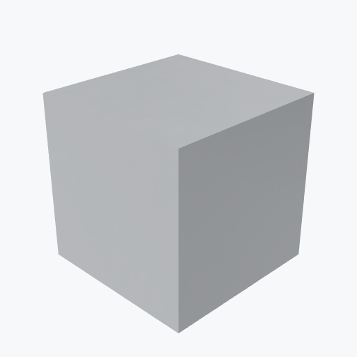

# PLA (Polylactic Acid)

<picture><source media="(prefers-color-scheme: dark)" srcset="previews/pla_cube_dark.png"></picture>

## Identity

| Field | Value |
|---|---|
| Formula | `C3H4O2` |

## Mechanical Properties

| Property | Value |
|---|---|
| Density | 1.25 g/cm³ |
| Young's Modulus | 2.7 GPa |
| Yield Strength | 50 MPa |

## Thermal Properties

| Property | Value |
|---|---|
| Melting Point | 160 °C |

## PBR (Rendering)

| Property | Value |
|---|---|
| Base Color | `(0.8, 0.8, 0.8, 1.0)` |
| Metallic | 0.0 |
| Roughness | 0.6 |

## Visual (mat-vis)

| Field | Value |
|---|---|
| Source | `ambientcg` |
| Material ID | `Plastic010` |
| Finish | white |
| Available Finishes | white, black, red, blue, green |
