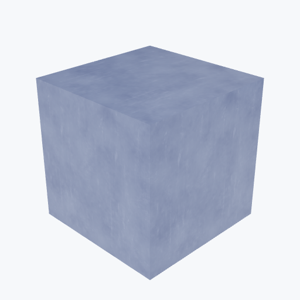

# PMMA (Acrylic)

<picture><source media="(prefers-color-scheme: dark)" srcset="previews/pmma_cube_dark.png"></picture>

## Identity

| Field | Value |
|---|---|
| Formula | `C5H8O2` |

## Mechanical Properties

| Property | Value |
|---|---|
| Density | 1.18 g/cm³ |
| Young's Modulus | 3.0 GPa |
| Yield Strength | 70 MPa |
| Tensile Strength | 75 MPa |

## Thermal Properties

| Property | Value |
|---|---|
| Melting Point | 160 °C |
| Thermal Conductivity | 0.19 W/(m·K) |
| Specific Heat | 1470 J/(kg·K) |

## PBR (Rendering)

| Property | Value |
|---|---|
| Base Color | `(0.95, 0.95, 0.95, 0.9)` |
| Metallic | 0.0 |
| Roughness | 0.1 |
| IOR | 1.49 |
| Transmission | 0.9 |

## Visual (mat-vis)

| Field | Value |
|---|---|
| Source | `ambientcg` |
| Material ID | `Plastic005` |
| Finish | clear |
| Available Finishes | clear |
