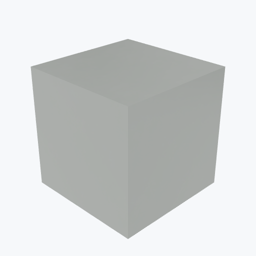

# Plastic Scintillator

<picture><source media="(prefers-color-scheme: dark)" srcset="previews/plastic_scint_cube_dark.png"></picture>

## Identity

| Field | Value |
|---|---|

## Mechanical Properties

| Property | Value |
|---|---|
| Density | 1.032 g/cm³ |

## PBR (Rendering)

| Property | Value |
|---|---|
| Base Color | `(0.9, 0.9, 0.85, 0.9)` |
| Metallic | 0.0 |
| Roughness | 0.4 |
| Transmission | 0.85 |

## Visual (mat-vis)

| Field | Value |
|---|---|
| Source | `ambientcg` |
| Material ID | `Plastic010` |
| Finish | clear |
| Available Finishes | clear |
